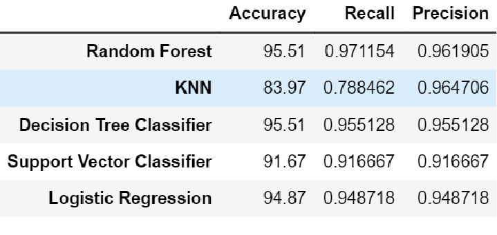

# Diabetes-Prediction-Using-Machine-Learning-Techniques

Model development is based on categorization methods such as logical Regression, Decision Tree,Random Forest,KNN,SVM algorithms.

## OBJECTIVES

- Gain a comprehensive understanding of diabetes and its various aspects.  
- Identify individuals at an early stage who may be at risk of developing diabetes based on their symptoms.  
- Build a model capable of accurately predicting the presence or absence of diabetes using symptom data.  
- Develop a model that efficiently processes symptom data to deliver timely results for healthcare professionals.  
- Determine the key symptoms that significantly contribute to diabetes prediction.  
- Create a unified platform offering comprehensive information about diabetes, including its types, causes, wellness advice, and commonly used medications.  
- Assess the performance and reliability of the proposed prediction model.  

## Introduction

Diabetes, a chronic and potentially life-threatening condition, is caused by elevated blood sugar levels. If left undiagnosed or untreated, it can lead to severe complications affecting organs such as the kidneys, eyes, heart, nerves, and feet. Traditional diagnostic methods, which rely on physical and chemical tests, can be time-consuming and require patients to visit diagnostic centers and consult doctors. However, advancements in machine learning have paved the way for addressing this critical issue more efficiently.  

This study focuses on developing a machine learning model to accurately predict the likelihood of diabetes at an early stage. Two classification algorithms, Logistic Regression and Random Forest, are employed to detect diabetes using the Bangladesh Diabetes Dataset (BDD) obtained from the Kaggle repository. The models are evaluated based on key performance metrics, including Precision, Accuracy, F-Measure, and Recall. Accuracy is calculated by analyzing correctly and incorrectly classified instances, with the Random Forest algorithm achieving a superior accuracy of 99% compared to Logistic Regression. The results are validated systematically using Receiver Operating Characteristic (ROC) curves.  

Machine learning, a branch of data science that enables machines to learn from experience, is a powerful tool for addressing complex medical challenges. Early prediction of diabetes is particularly difficult due to the interplay of multiple factors. This project leverages the potential of machine learning to enhance predictive accuracy by combining results from multiple techniques through ensemble learning. Ensemble learning integrates various methods into a single optimized system, reducing bias and variance while improving overall predictions.  

The project utilizes a dataset comprising 17 variables sourced from the UCI repository. By employing three different supervised machine learning approaches, this system aims to deliver reliable and timely predictions, contributing to more effective diabetes management and prevention strategies.

: This project is aimed to predict the diabetes using machine learning techniques. The dataset used in this project contains 16 features 

1. Age: Age in years ranging from (20years to 65 years)
2. Gender: Male / Female
3. Polyuria: Yes / No
4. Polydipsia: Yes/ No
5. Sudden weight loss: Yes/ No
6. Weakness: Yes/ No
7. Polyphagia: Yes/ No
8. Genital Thrush: Yes/ No
9. Visual blurring: Yes/ No
10. Itching: Yes/ No
11. Irritability: Yes/No
12. Delayed healing: Yes/ No
13. Partial Paresis: Yes/ No
14. Muscle stiffness: yes/ No
15. Alopecia: Yes/ No
16. Obesity: Yes/ No
17. Class: Positive / Negative

## Libraries

a. Pandas
b. NumPy
c. Sklearn
d. Matplotlib
e. Seaborn

## RESULTS AND DISCUSSION

The proposed approach employs various classification and ensemble methods, implemented using Python. These methods are standard machine learning techniques designed to extract the highest accuracy from the data. Among the methods utilized, the Random Forest classifier demonstrated superior performance compared to the others. Overall, this work leverages advanced machine learning techniques to enhance prediction accuracy and achieve high-performance outcomes. The results of these methods are illustrated in the accompanying figure.
